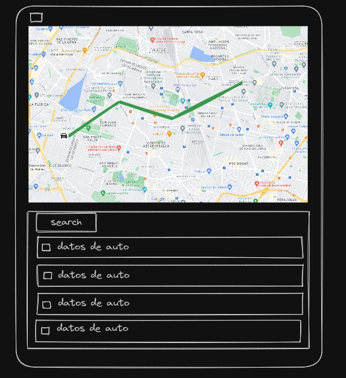

## Code Challenge

Summary: Create a web application that displays a map as the main section with routes and vehicles details, followed by a list of vehicles, a form to add vehicles and possibility to update (nice to have) and delete (nice to have) data lastly implement a search that affects that list.

## Node.js API

- Implement a backend in Node.js using Express.
- Create endpoints to create, retrieve, update, and delete vehicle data.
- Persist vehicle data in a database. You can use MongoDB, Firebase or other preferred database
- Implement a search engine in the backend that filters the vehicle list based on different criteria like vehicle type, status, or any other relevant attribute.
- Ensure that any newly created or updated vehicles are reflected in real-time in the vehicle list, mirroring any changes made to the backend data.

## Map Styling and Representation

- The map must be the main element. Modify its style so that it is not the default.
- Implement dynamic zoom and centering based on the route's bounding box.
- Allow users to interact with the map, such as zooming in/out, dragging.
- Add the route representation to the map (based on the provided routes service in this readme).

## Vehicle List

- Represents a list of vehicles (from the backend API) use [vehicle mock](assets/carMock.json) as reference.
- Displays vehicle data in each row of the list.
- Implement pagination for the vehicle list, especially if the list grows large.
- If feasible, incorporate real-time updates and deletion for the vehicle list, reflecting any changes in the backend data (nice to have).

## Vehicle Details and Search Engine

- Clicking on each table item (vehicle) should display a clickable icon within the map (position must be near the route plotted on the map; any dummy position is valid).
- Add a search engine that affects the table (the more data the search engine considers, the better).
- Expand the information displayed on clicking a vehicle, providing more details about its status, location, or any other data.
- Allow users to interact with the map directly from the table. Clicking on a vehicle in the table should highlight its position on the map.
- Enhance the search engine to support advanced filtering, allowing users to search based on multiple criteria simultaneously (Nice to have)

## Vehicle Form and Data Persistence

- Create a vehicle form that allows users to input information about a new vehicle.
- The form should include fields for vehicle type, status, and any other relevant attributes use [vehicle mock](assets/carMock.json) as reference.
- Implement validation for the form fields to ensure that the required information is provided and in the correct format.
- On form submission, send the vehicle data to the backend API.
- Ensure that the list reflects any changes made to the backend data.
- The style and display of the forms is open-ended and allows for creativity. You have the freedom to design the forms in a visually appealing and user-friendly manner.

## Route Service

- Method: GET
- Authorization: None
- Endpoint: [get route detail](https://iorm9noapi.execute-api.us-east-1.amazonaws.com/challenge/route/dummy1)
- Refer to [route example](assets/exampleRoute.geojson) to see what to expect

## Wireframe (low level) of the possible result

The layout is just a proposal, there is no limit in creativity, add vehicle form as you wish

## Technologies

Ideally, we are looking for you to implement the challenge using the following technologies:

- Backend: Node.js, Express, MongoDB or Firebase
- Frontend: TypeScript, ReactJS, Next.js
- You can choose any library for map rendering or for other functionalities.

## Deliverables

- The URL of a live demo; we recommend Vercel, but any provider is acceptable.
- The URL of the public GitHub repository of the project.

## Estimated Time

This technical test is estimated to take approximately three to four days to complete.

## Additional Resources

- [Node.js Documentation](https://nodejs.org/en/docs/)
- [Express Documentation](https://expressjs.com/)
- [MongoDB Documentation](https://docs.mongodb.com/)
- [Firebase Documentation](https://firebase.google.com/docs)
- [React Documentation](https://reactjs.org/docs/getting-started.html)
- [TypeScript Tutorial](https://www.typescriptlang.org/docs/)

## Extras

- Git flow.
- Clean code.
- Testing.
- Styling and finishing.
- Responsiveness
- Any improvement/functionality/extra styling will be taken into account.
- Proper error handling for API requests, ensuring a smooth user experience even if there are issues with data retrieval.
- Add loading states to indicate when data is being fetched, providing feedback to users.
- Provide documentation for the project.

Remember to balance the time spent on each enhancement based on your skills and the overall time estimate for the test. Good luck!